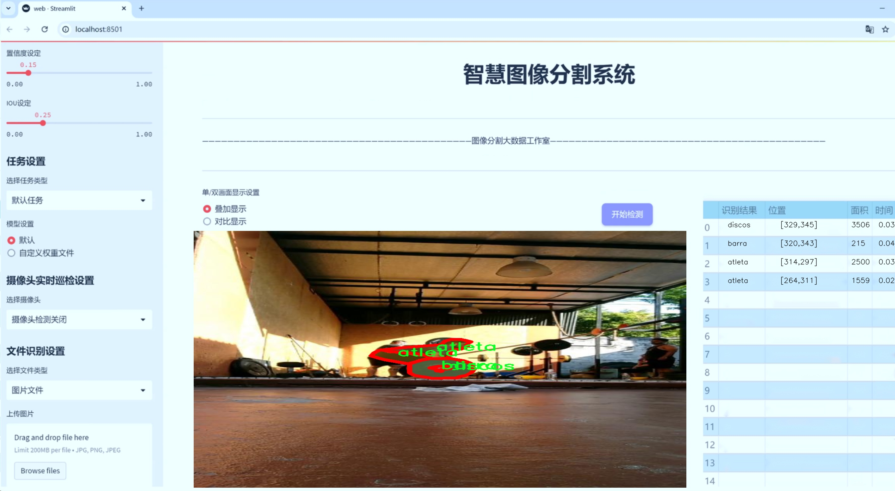
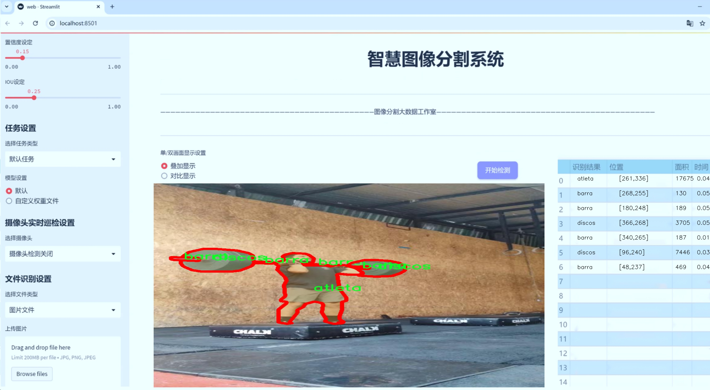
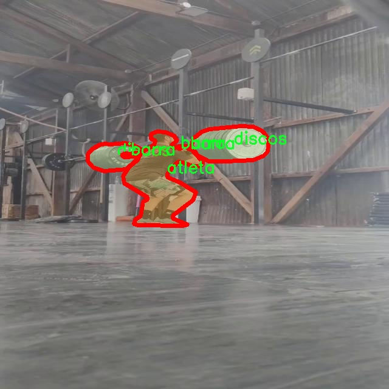

# 运动员动作分割系统： yolov8-seg-GFPN

### 1.研究背景与意义

[参考博客](https://gitee.com/YOLOv8_YOLOv11_Segmentation_Studio/projects)

[博客来源](https://kdocs.cn/l/cszuIiCKVNis)

研究背景与意义

随着体育科学的不断发展，运动员的动作分析在提高运动表现、预防运动损伤和优化训练方案等方面扮演着越来越重要的角色。传统的运动员动作分析方法多依赖于人工观察和录像回放，这不仅耗时耗力，而且主观性强，容易受到观察者的经验和情绪影响。近年来，计算机视觉技术的迅猛发展为运动员动作分析提供了新的解决方案，尤其是基于深度学习的目标检测与分割技术，已经在多个领域取得了显著的成果。其中，YOLO（You Only Look Once）系列模型因其高效的实时检测能力和较高的准确性，逐渐成为运动员动作分析的重要工具。

在众多YOLO模型中，YOLOv8作为最新版本，进一步提升了目标检测和分割的性能，具有更强的特征提取能力和更快的推理速度。针对运动员动作分割的需求，基于改进YOLOv8的运动员动作分割系统的研究具有重要的理论和实践意义。该系统不仅能够实时识别运动员的动作，还能够对不同类别的运动器械进行精准分割，为运动员的动作分析提供了更加全面和细致的数据支持。

本研究所使用的数据集包含1600张图像，涵盖了四个类别：运动员（atleta）、器械（barra）、重物（discos）以及YOLO分割模块（yolo_segmentation）。这些数据的多样性和丰富性为模型的训练和测试提供了良好的基础。通过对这些图像的分析，可以深入探讨运动员在不同器械和重物下的动作表现，进而为教练员和运动员提供科学的训练建议和改进方案。

此外，基于改进YOLOv8的运动员动作分割系统不仅能够提升运动员的训练效率，还能在比赛中为运动员提供实时反馈，帮助他们及时调整动作，减少受伤风险。通过对运动员动作的精准分割与分析，教练员可以更好地理解运动员的技术动作，从而制定个性化的训练计划，提升运动员的竞技水平。

在学术研究方面，本研究的创新之处在于将YOLOv8模型应用于运动员动作分割领域，并通过改进算法提升其在复杂场景下的表现。这不仅丰富了计算机视觉在体育领域的应用研究，也为后续相关研究提供了新的思路和方法。此外，研究成果有望推动运动科学、计算机视觉和人工智能等多学科的交叉融合，促进相关领域的共同发展。

综上所述，基于改进YOLOv8的运动员动作分割系统的研究，不仅具有重要的理论价值，也具备广泛的应用前景。通过深入探讨运动员的动作特征，推动运动训练的科学化、系统化，最终实现提高运动员竞技水平和保障运动安全的目标。

### 2.图片演示






注意：本项目提供完整的训练源码数据集和训练教程,由于此博客编辑较早,暂不提供权重文件（best.pt）,需要按照6.训练教程进行训练后实现上图效果。

### 3.视频演示

[3.1 视频演示](https://www.bilibili.com/video/BV1fzUoYpEUG/)

### 4.数据集信息

##### 4.1 数据集类别数＆类别名

nc: 3
names: ['atleta', 'barra', 'discos']


##### 4.2 数据集信息简介

数据集信息展示

在本研究中，我们采用了名为“yolo_segmentation”的数据集，以训练和改进YOLOv8-seg的运动员动作分割系统。该数据集专注于运动员在进行各种训练和比赛时的动作捕捉，旨在通过高效的图像分割技术，提升对运动员动作的理解和分析能力。数据集的设计考虑到了运动员在不同环境下的表现，确保能够涵盖多种场景和条件，以便为模型提供丰富的训练样本。

“yolo_segmentation”数据集包含三种主要类别，分别是“atleta”（运动员）、“barra”（杠杆）和“discos”（圆盘）。这些类别的选择反映了运动员在训练和比赛中常见的元素，能够有效地帮助模型识别和分割运动员的动作。具体而言，“atleta”类别涵盖了各种运动员的姿态和动作，能够为模型提供多样化的运动表现样本；“barra”类别则代表了运动员在使用杠杆进行训练时的情境，强调了杠杆在运动过程中的重要性；而“discos”类别则聚焦于运动员在使用圆盘进行训练时的动态表现，展现了不同器械对运动员动作的影响。

数据集的构建过程经过精心设计，确保每个类别的样本数量均衡且多样化，以提高模型的泛化能力。通过对不同运动员在多种环境下的动作进行捕捉，数据集涵盖了从基础训练到高强度比赛的多种场景。这种多样性不仅能够帮助模型学习到运动员在不同条件下的表现，还能提高其在实际应用中的鲁棒性。

此外，数据集中的图像均经过精细标注，确保每个类别的边界清晰可辨。这种高质量的标注对于训练深度学习模型至关重要，因为它直接影响到模型的学习效果和最终的分割精度。我们采用了先进的标注工具和技术，确保每个样本的标注准确无误，进而为YOLOv8-seg模型的训练提供坚实的基础。

在训练过程中，我们将“yolo_segmentation”数据集与YOLOv8-seg模型相结合，利用其强大的特征提取和分割能力，旨在实现对运动员动作的精准识别和分割。通过对运动员动作的深入分析，我们希望能够为运动科学研究、运动员训练以及相关领域提供更为科学的依据和指导。

总之，“yolo_segmentation”数据集为改进YOLOv8-seg的运动员动作分割系统提供了丰富的训练资源。其精心设计的类别和高质量的标注，确保了模型在运动员动作识别和分割任务中的有效性和准确性。随着研究的深入，我们期待该数据集能够为运动员的训练和表现分析带来新的突破，推动运动科学的进一步发展。





### 5.项目依赖环境部署教程（零基础手把手教学）

[5.1 环境部署教程链接（零基础手把手教学）](https://www.bilibili.com/video/BV1jG4Ve4E9t/?vd_source=bc9aec86d164b67a7004b996143742dc)


[5.2 安装Python虚拟环境创建和依赖库安装视频教程链接（零基础手把手教学）](https://www.bilibili.com/video/BV1nA4VeYEze/?vd_source=bc9aec86d164b67a7004b996143742dc)

### 6.手把手YOLOV8-seg训练视频教程（零基础手把手教学）

[6.1 手把手YOLOV8-seg训练视频教程（零基础小白有手就能学会）](https://www.bilibili.com/video/BV1cA4VeYETe/?vd_source=bc9aec86d164b67a7004b996143742dc)


按照上面的训练视频教程链接加载项目提供的数据集，运行train.py即可开始训练



     Epoch   gpu_mem       box       obj       cls    labels  img_size
     1/200     0G   0.01576   0.01955  0.007536        22      1280: 100%|██████████| 849/849 [14:42<00:00,  1.04s/it]
               Class     Images     Labels          P          R     mAP@.5 mAP@.5:.95: 100%|██████████| 213/213 [01:14<00:00,  2.87it/s]
                 all       3395      17314      0.994      0.957      0.0957      0.0843

     Epoch   gpu_mem       box       obj       cls    labels  img_size
     2/200     0G   0.01578   0.01923  0.007006        22      1280: 100%|██████████| 849/849 [14:44<00:00,  1.04s/it]
               Class     Images     Labels          P          R     mAP@.5 mAP@.5:.95: 100%|██████████| 213/213 [01:12<00:00,  2.95it/s]
                 all       3395      17314      0.996      0.956      0.0957      0.0845

     Epoch   gpu_mem       box       obj       cls    labels  img_size
     3/200     0G   0.01561    0.0191  0.006895        27      1280: 100%|██████████| 849/849 [10:56<00:00,  1.29it/s]
               Class     Images     Labels          P          R     mAP@.5 mAP@.5:.95: 100%|███████   | 187/213 [00:52<00:00,  4.04it/s]
                 all       3395      17314      0.996      0.957      0.0957      0.0845


### 7.50+种全套YOLOV8-seg创新点加载调参实验视频教程（一键加载写好的改进模型的配置文件）

[7.1 50+种全套YOLOV8-seg创新点加载调参实验视频教程（一键加载写好的改进模型的配置文件）](https://www.bilibili.com/video/BV1Hw4VePEXv/?vd_source=bc9aec86d164b67a7004b996143742dc)

### YOLOV8-seg算法简介

原始YOLOv8-seg算法原理

YOLOv8-seg算法是Ultralytics在2023年发布的一款先进的目标检测与分割模型，标志着YOLO系列算法的又一次重大进步。该算法在YOLOv5的基础上，结合了近两年内多种优秀设计理念，特别是YOLOX、YOLOv6、YOLOv7和PP-YOLOE等模型的创新，形成了一个更加高效和精准的检测框架。YOLOv8-seg不仅在目标检测上表现出色，同时也在实例分割任务中展现了其强大的能力。

YOLOv8-seg的网络结构主要分为三个部分：Backbone、Neck和Head。每个部分都在特征提取、特征融合和目标检测方面发挥着重要作用。Backbone部分负责从输入图像中提取多层次的特征信息。该部分采用了一系列卷积和反卷积层，结合残差连接和瓶颈结构，旨在减小网络的参数量并提升性能。具体而言，YOLOv8-seg的Backbone使用了C2模块作为基本构成单元，构建了由5个CBS模块、4个C2f模块和1个快速空间金字塔池化(SPPF)模块组成的结构。这种设计不仅保留了特征提取的有效性，还在一定程度上提高了模型的计算效率。

在Neck部分，YOLOv8-seg采用了多尺度特征融合技术，将来自Backbone不同阶段的特征图进行融合。这一过程使得模型能够更好地捕捉不同尺度目标的信息，从而提高了目标检测的性能和鲁棒性。通过对不同层次特征的融合，YOLOv8-seg能够在处理复杂场景时，保持较高的检测精度和稳定性。

Head部分则是YOLOv8-seg的核心，负责最终的目标检测和分类任务。该部分设有三个检测头，分别用于在不同尺寸信息下检测目标。每个检测头都包含一系列卷积层和反卷积层，旨在生成高质量的检测结果。值得注意的是，YOLOv8-seg在设计头部网络时，借鉴了YOLOX中使用的解耦头的思路，通过两条并行的分支分别提取类别和位置特征。这种设计使得分类任务与定位任务能够更有效地协同工作，提升了模型的收敛速度和预测精度。

YOLOv8-seg在训练过程中对数据增强策略进行了优化，特别是在Mosaic数据增强的使用上。尽管Mosaic增强有助于提升模型的鲁棒性和泛化能力，但在一定程度上也可能破坏数据的真实分布。为此，YOLOv8-seg在训练的最后10个epoch中停止使用Mosaic数据增强，以确保模型能够学习到更真实和有效的特征信息。

在模型的具体实现上，YOLOv8-seg的Backbone部分对C3模块进行了改进，采用了C2f模块。这一模块在C3模块的基础上引入了YOLOv7中的ELAN思想，增加了更多的跳层连接，从而获得更丰富的梯度流信息，同时保证了模型的轻量化。此外，SPPF模块的保留也使得特征提取的效果得以维持，同时减少了执行时间。

在Neck部分，YOLOv8-seg同样将所有的C3模块更改为C2f模块，并删除了两处上采样之前的卷积连接层。这一系列的改进使得模型在保持高效特征融合的同时，进一步提升了计算效率。

YOLOv8-seg的Head部分则采用了无锚框结构，直接预测目标的中心位置，并引入了任务对齐学习(Task Alignment Learning, TAL)机制，以区分正负样本。通过结合分类分数和IOU的高次幂乘积作为衡量任务对齐程度的指标，YOLOv8-seg在分类和定位损失函数中引入了这一指标，从而实现了更为精准的目标检测和分类。

在实际应用中，YOLOv8-seg展现出了优越的性能。通过在COCO数据集上的测试，YOLOv8-seg在不同尺寸的模型中取得了较好的检测精度，尤其是在相同参数量的情况下，其mAP（mean Average Precision）表现优于其他YOLO系列模型。此外，YOLOv8-seg在推理速度上也表现出色，能够满足实时检测的需求。

综上所述，YOLOv8-seg算法通过对网络结构的精心设计和优化，结合了多种先进的技术理念，极大地提升了目标检测和实例分割的性能。其在精度和速度上的平衡，使得YOLOv8-seg在实际应用中具有广泛的前景，尤其是在需要实时处理的场景中，如自动驾驶、智能监控和机器人视觉等领域。随着YOLOv8-seg的不断发展和完善，未来有望在更多的应用场景中发挥重要作用。


### 9.系统功能展示（检测对象为举例，实际内容以本项目数据集为准）

图9.1.系统支持检测结果表格显示

  图9.2.系统支持置信度和IOU阈值手动调节

  图9.3.系统支持自定义加载权重文件best.pt(需要你通过步骤5中训练获得)

  图9.4.系统支持摄像头实时识别

  图9.5.系统支持图片识别

  图9.6.系统支持视频识别

  图9.7.系统支持识别结果文件自动保存

  图9.8.系统支持Excel导出检测结果数据


### 10.50+种全套YOLOV8-seg创新点原理讲解（非科班也可以轻松写刊发刊，V11版本正在科研待更新）

#### 10.1 由于篇幅限制，每个创新点的具体原理讲解就不一一展开，具体见下列网址中的创新点对应子项目的技术原理博客网址【Blog】：


[10.1 50+种全套YOLOV8-seg创新点原理讲解链接](https://gitee.com/qunmasj/good)

#### 10.2 部分改进模块原理讲解(完整的改进原理见上图和技术博客链接)【如果此小节的图加载失败可以通过CSDN或者Github搜索该博客的标题访问原始博客，原始博客图片显示正常】
### YOLOv8简介
在各种目标检测算法中，YOLO系列因其速度和准确度间的优异平衡脱颖而出，能够准确、快速的识别目标，便于部署到各种移动设备中，已经广泛应用于各种领域的目标检测、跟踪和分割。目前最新版本 YOLOv8由原v5的开发团队Ultralytics于2023年1月提出，按规格大小可划分为n、s、m、1和x5个版本，是目前最先进的目标检测算法，有着优异的性能，很适合用于无人机航拍图像目标检测。其网络结构如图所示。

YOLOv8模型包括Input、Backbone、Neck 和Head4部分。其中 Input选用了Mosaic数据增强方法，并且对于不同大小的模型，有部分超参数会进行修改，典型的如大模型会开启 MixUp 和CopyPaste数据增强，能够丰富数据集，提升模型的泛化能力和鲁棒性。Backbone主要用于提取图片中的信息，提供给Neck和Head使用，由多个Conv、C2f模块和尾部的SPPF组成。Conv模块由单个Conv2d、
BatchNorm2d和激活函数构成,用丁是双行在万E5特征图;YOLOv8参考了C3模块的残左绒以心YOLOv7[16l的ELAN思想，设计出了C2f 结构，可以在保证轻量化的同时获得更加丰富的梯度流信息，并根据模型尺度来调整通道数，大幅提升了模型性能;SPPF是空间金字塔池化，能够融合不同尺度的特征。Neck部分主要起特征融合的作用，充分利用了骨干网络提取的特征，采用FPN[17]+PAN[18〕结构，
能够增强多个尺度上的语义表达和定位能力。Head输出端根据前两部分处理得到的特征来获取检测目标的类别和位置信息，做出识别,换以小旦公来和定解耦头结构,将分类和检测头分:9w‘无锅框的位关注侧重点不同的问题，同时也采用了无锚框的目标检测（Anchor-Free)，能够提升检测速度。Loss计算方面采用了正负样本动态分配策略，使用 VFLLoss 作为分类损失，使用DFLLoss+CIOU Loss作为回归损失。

### AutoFocus: Efficient Multi-Scale Conv简介

参考该博客提出了AutoFocus，一种高效的多尺度目标检测算法。相较于以前对整个图像金字塔进行处理，该方法以一种由表及里的姿态，仅处理哪些整体上看来很有可能存在小物体的区域。这个可以通过预测一张类别未知的分割图FocusPixels来得到。为了高效利用FocusPixels，另外一个算法用于产生包含FocusPixels的FocusChips，这样可以减少计算量并处理更更精细的尺度。在不同尺度上FocusChips所得到的检测结果综合时，会出现问题，我们也提供了解决问题的方案。AutoFocus在COCO上的结果有49.7%mAP（50%重叠下68.3%），与多尺度baseline相仿但是快了2.5倍。金字塔中处理的像素数量减少了5倍mAP只下降1%，在与RetinaNet采用相同的ResNet-101结构且速度相同时，高了10%mAP。

人类寻找物体是一个动态的过程，且寻找时间与场景的复杂度是直接相关的。当我们的眼神在不同的点之间漂移时，其他的区域会被我们有意忽视。然而，现在的检测算法是一种静态的推理过程且图像金字塔中的每个像素都受到了一样的对待，这使得过程变得没有效率。现在许多的应用都不强调实时性，而计算上的节省其实可以产生很大收益。

在COCO数据集中，虽然40%的物体都是小物体，但是它们一共只占了全图的0.3%。如果金字塔是3倍关系，则在高分辨率层要进行9倍的运算。XXX 。那么有没有办法在低分辨率下找出可能含有这些物体的区域呢？

以人眼方案类比，我们可以从低分辨率图像开始，找出有可能存在物体的区域再“聚集”到高分辨率。我们的AutoFocus会在一层中计算小物体的分割图FocusPixels，而在每一个FocusPixels上会用一个算法产生下一层所需要关注的chips。在COCO的最大分辨率层上我们可以只处理**20%的像素而性能不下降，如果只处理5%**也只下降1%而已。


图像金字塔与卷积神经网络对CV十分重要。然而卷积神经网络无法做到对尺度不敏感，所以为了不同大小的物体需要依赖图像金字塔。虽然训练已经有了高效的方法，但是其推断时间依然远离实际使用标准。

目标检测加速有很长历史了。常用的有特征近似以减少尺度、级联、特征金字塔，且最后一个最近很多人研究。

AutoFocus为速度与精度之间提供了一个平滑的折衷，指出可以在低分辨率下看出小物体的所在，从而节约计算。FocusPixels的计算较为容易。

先简单介绍一下SNIP，是一种多尺度的训练、推断算法。主要思想是训练针对某个特定scale的检测器而不是scale-invariant检测器。这样训练样本就局限于在某个尺度范围内，以适于这个检测器处理。比如在高分辨率仅处理小物体而高分辨率仅处理大物体，其优势在于训练时不用考虑尺度的变化。

由于训练时物体大小是已知的，我们在图像金字塔中可以忽略大量区域而只处理物体周围的区域。SNIPER说明这样低分辨率的训练与全图训练相比并不会降低性能。同样，在推断过程中如果可以在大分辨率图像上预测可能出现小物体的chip，我们也就不用处理整张高分辨率图片。在训练时，许多物体会被裁剪、扭曲，这可以当作是一种数据扩增，然而当这个情况在推断时出现，则会产生错误，所以我们还需要一个算法来整合不同尺度上的检测结果。

#### AutoFocus框架
如SIFT、SURF等传统分类特征包含两个组件，一个detector和一个descriptor。detector只包含轻量级的操作如DoG、LoG，用于在整张图片上找到感兴趣的区域；descriptor，一般来说计算量比较大，则只需要关注那些咸兴趣的区域。这个级联结构保障了图片处理的效率。

同样，AutoFocus框架也是用于预测感兴趣的区域，并丢弃在下一尺度不可能存在物体的区域，并将裁剪和缩放后的区域传递给下一尺度。AutoFocus由三个部分组成：FocusPixels，FocusChips和focus stacking。

#### FocusPixels
FocusPixels定义在卷积网络特征图的粒度之上（如conv5），如果特征图上某个像素与小物体有重叠则标注为一个FocusPixel。（小物体：面积处于一个网络的输入范围之内）。训练过程中，FocusPixels标注为正，某些与不在面积范围内的物体有重叠的像素标注为无效，其他像素标注为负。AutoFocus的训练目标是使在FocusPixels区域产生较大的激活值。

如果同时多个物体与同一像素重叠，优先给正标注。我们的网络输入是512x512，然后a,b,c取值分别是5,64,90。对于太大或太小的物体，我们认为当前尺度上没有足够人信息进行判断，所以会标定为无效。整个网络结构如下图。训练时加两层带ReLU的卷积(3x3和1x1)以及一个二分类softmax来预测FocusPixels。


#### FocusChip生成
推断过程中，我们标注输出概率大于阈值t的像素（这个参数可以控制加速比），得到一些连通域。对于每一个域，我们做一次膨胀使其包含一些有助于识别的周围信息，膨胀后相连的部分要合并。然后，我们生成一些包含连通域的chips（不同chips可能重叠，如有重叠则合并）。有些chip可能太小缺少必要信息，并使chip的大小变化很大，为了效率我们要求保证一个最小的chip size。算法流程如下：


#### 级联推断过程
我们的过程类似于图片金字塔的推断过程但是在过程中一步步去除不关注的图片区域。我们在最低分辨率上进行检测并生成chips，然后在这些chips再进行检测和生成chips。

#### Focus Stacking
这种级联分类器的一个问题是在chip边缘本来的大物体可能生成一些被剪裁的检测目标。在下一个尺度上，由于剪裁过了，所以会检测到小的、错误的正例False Positive。之前算法中的第二步膨胀其实就是为了保证没有物体会出现在chip的边缘。这样，当我们在局部图片chip的边缘检测到物体时，就可以把这个检测结果丢弃，即使其在SNIP的范围内。

也有一些物体在图片边缘的特殊情况。如果chip和图片共享一条边的话，我们会检查检测结果的其他边是否完全在里面，如果在，则保留它，否则丢弃。

在每一尺度得到有效检测结果后，我们可以将不同尺度上的结果进行整合，将这些结果映射到原图坐标系上。最后，非极大值抑制NMS用于聚集。网络结构如之前的图片所示。


### 11.项目核心源码讲解（再也不用担心看不懂代码逻辑）

#### 11.1 ultralytics\models\yolo\detect\predict.py

以下是对代码的逐文件分析，并保留了最核心的部分，同时添加了详细的中文注释：

```python
# Ultralytics YOLO 🚀, AGPL-3.0 license

from ultralytics.engine.predictor import BasePredictor  # 导入基础预测器类
from ultralytics.engine.results import Results  # 导入结果类
from ultralytics.utils import ops  # 导入操作工具

class DetectionPredictor(BasePredictor):
    """
    DetectionPredictor类扩展了BasePredictor类，用于基于检测模型进行预测。

    示例:
        ```python
        from ultralytics.utils import ASSETS
        from ultralytics.models.yolo.detect import DetectionPredictor

        args = dict(model='yolov8n.pt', source=ASSETS)
        predictor = DetectionPredictor(overrides=args)
        predictor.predict_cli()
        ```
    """

    def postprocess(self, preds, img, orig_imgs):
        """后处理预测结果并返回Results对象的列表。"""
        
        # 应用非极大值抑制（NMS）来过滤冗余的检测框
        preds = ops.non_max_suppression(preds,
                                        self.args.conf,  # 置信度阈值
                                        self.args.iou,  # IOU阈值
                                        agnostic=self.args.agnostic_nms,  # 是否类别无关的NMS
                                        max_det=self.args.max_det,  # 最大检测框数量
                                        classes=self.args.classes)  # 过滤特定类别

        # 如果输入图像不是列表，则将其转换为numpy数组
        if not isinstance(orig_imgs, list):  # 输入图像是torch.Tensor，而不是列表
            orig_imgs = ops.convert_torch2numpy_batch(orig_imgs)  # 转换为numpy批量图像

        results = []  # 初始化结果列表
        for i, pred in enumerate(preds):  # 遍历每个预测结果
            orig_img = orig_imgs[i]  # 获取原始图像
            # 根据原始图像的尺寸缩放检测框
            pred[:, :4] = ops.scale_boxes(img.shape[2:], pred[:, :4], orig_img.shape)
            img_path = self.batch[0][i]  # 获取图像路径
            # 将结果添加到结果列表中
            results.append(Results(orig_img, path=img_path, names=self.model.names, boxes=pred))
        
        return results  # 返回处理后的结果列表
```

### 代码核心部分说明：
1. **类定义**：`DetectionPredictor`类继承自`BasePredictor`，用于处理基于YOLO模型的目标检测任务。
2. **后处理方法**：`postprocess`方法负责对模型的预测结果进行后处理，包括应用非极大值抑制（NMS）以减少冗余的检测框，并将预测框缩放到原始图像的尺寸。
3. **结果存储**：将处理后的结果存储在`Results`对象中，并返回一个包含所有结果的列表。

这个文件是Ultralytics YOLO（You Only Look Once）模型的一个预测模块，主要用于基于检测模型进行预测。文件中定义了一个名为`DetectionPredictor`的类，该类继承自`BasePredictor`，用于处理图像检测任务。

在类的文档字符串中，提供了一个使用示例，展示了如何导入`DetectionPredictor`类并创建一个预测器实例。用户可以通过传入模型路径和数据源来初始化预测器，并调用`predict_cli()`方法进行预测。

类中定义了一个`postprocess`方法，该方法用于对模型的预测结果进行后处理。具体来说，它接收三个参数：`preds`（模型的预测结果）、`img`（输入图像）和`orig_imgs`（原始图像）。在方法内部，首先调用`ops.non_max_suppression`函数对预测结果进行非极大值抑制，以去除冗余的检测框。该函数使用了一些参数，如置信度阈值、IOU阈值、是否使用类无关的NMS、最大检测框数量和需要检测的类别。

接下来，方法检查输入的原始图像是否为列表。如果不是，说明输入的是一个Torch张量，这时需要将其转换为NumPy数组。然后，方法会遍历每个预测结果，使用`ops.scale_boxes`函数将预测框的坐标缩放到原始图像的尺寸。每个预测结果会与原始图像及其路径一起封装成一个`Results`对象，并添加到结果列表中。

最后，`postprocess`方法返回一个包含所有结果的列表，这些结果可以用于后续的分析或可视化。整体来看，这个文件的主要功能是提供一个高效的预测流程，支持YOLO模型在给定图像上的目标检测任务。

#### 11.2 ultralytics\utils\callbacks\raytune.py

以下是代码中最核心的部分，并附上详细的中文注释：

```python
# 导入Ultralytics YOLO所需的设置
from ultralytics.utils import SETTINGS

# 尝试导入Ray库并验证Ray Tune集成是否启用
try:
    assert SETTINGS['raytune'] is True  # 验证Ray Tune集成是否启用
    import ray
    from ray import tune
    from ray.air import session

except (ImportError, AssertionError):
    tune = None  # 如果导入失败或集成未启用，则将tune设置为None


def on_fit_epoch_end(trainer):
    """在每个训练周期结束时，将训练指标发送到Ray Tune。"""
    if ray.tune.is_session_enabled():  # 检查Ray Tune会话是否启用
        metrics = trainer.metrics  # 获取当前训练的指标
        metrics['epoch'] = trainer.epoch  # 将当前周期数添加到指标中
        session.report(metrics)  # 向Ray Tune报告当前指标


# 定义回调函数字典，如果tune可用，则包含on_fit_epoch_end回调
callbacks = {
    'on_fit_epoch_end': on_fit_epoch_end, 
} if tune else {}
```

### 代码说明：
1. **导入设置**：首先从`ultralytics.utils`导入`SETTINGS`，以获取配置参数。
2. **Ray库的导入与验证**：尝试导入Ray库及其相关模块，并检查`SETTINGS`中是否启用了Ray Tune集成。如果未启用或导入失败，则将`tune`设置为`None`。
3. **定义回调函数**：`on_fit_epoch_end`函数在每个训练周期结束时被调用。它会检查Ray Tune会话是否启用，如果启用，则获取当前训练的指标并将其报告给Ray Tune。
4. **回调字典**：根据`tune`是否可用，定义一个包含回调函数的字典`callbacks`。如果`tune`不可用，则该字典为空。

这个程序文件的主要功能是将训练过程中的指标（metrics）发送到Ray Tune，以便进行超参数调优。首先，文件引入了Ultralytics库中的设置（SETTINGS），并检查Ray Tune的集成是否已启用。如果启用，则导入Ray库及其相关模块；如果未启用或导入失败，则将`tune`设置为`None`。

在文件中定义了一个名为`on_fit_epoch_end`的函数，该函数在每个训练周期结束时被调用。函数内部首先检查Ray Tune的会话是否已启用，如果启用，则获取当前训练器（trainer）的指标，并将当前的训练周期（epoch）添加到指标中。最后，使用`session.report(metrics)`将这些指标报告给Ray Tune。

最后，文件创建了一个名为`callbacks`的字典，如果`tune`不为`None`（即Ray Tune可用），则将`on_fit_epoch_end`函数作为回调函数添加到字典中；如果`tune`为`None`，则`callbacks`字典为空。这种设计使得在使用Ray Tune进行超参数调优时，可以方便地将训练指标发送到Ray Tune进行监控和分析。

#### 11.3 ultralytics\models\sam\__init__.py

以下是保留的核心代码部分，并附上详细的中文注释：

```python
# 导入必要的模块
from .model import SAM  # 从当前包的model模块中导入SAM类
from .predict import Predictor  # 从当前包的predict模块中导入Predictor类

# 定义当前模块的公开接口
__all__ = 'SAM', 'Predictor'  # 这表示当使用from module import *时，只会导入SAM和Predictor
```

### 代码注释说明：
1. **导入模块**：
   - `from .model import SAM`：这行代码从当前包的`model`模块中导入`SAM`类，`SAM`可能是一个与模型相关的类。
   - `from .predict import Predictor`：这行代码从当前包的`predict`模块中导入`Predictor`类，`Predictor`可能是一个用于进行预测的类。

2. **定义公开接口**：
   - `__all__ = 'SAM', 'Predictor'`：这个特殊变量`__all__`用于定义当使用`from module import *`时，哪些名称是可以被导入的。在这里，只有`SAM`和`Predictor`会被导入，其他未列出的名称将不会被导入。这是一种控制模块导出内容的方式。

这个程序文件是一个Python模块的初始化文件，位于`ultralytics/models/sam`目录下。文件的开头有一行注释，表明这是与Ultralytics YOLO相关的代码，并且该代码遵循AGPL-3.0许可证。

在文件中，首先从同一目录下导入了两个类：`SAM`和`Predictor`。`SAM`可能是一个与模型相关的类，而`Predictor`则可能是用于进行预测的类。这种导入方式使得在其他模块中使用这些类时更加方便。

最后，`__all__`变量被定义为一个元组，包含了字符串`'SAM'`和`'Predictor'`。这个变量的作用是控制`from module import *`语句的行为，只有在`__all__`中列出的名称才能被导入。这有助于明确模块的公共接口，避免不必要的名称冲突。

总的来说，这个文件的主要功能是组织和导出与SAM模型相关的类，以便在其他地方使用。

#### 11.4 ultralytics\solutions\object_counter.py

以下是经过简化和注释的核心代码部分，主要关注对象计数的逻辑和处理过程：

```python
from collections import defaultdict
import cv2
from shapely.geometry import Polygon
from shapely.geometry.point import Point
from ultralytics.utils.plotting import Annotator, colors

class ObjectCounter:
    """用于实时视频流中对象计数的类。"""

    def __init__(self):
        """初始化计数器，设置默认值。"""
        self.reg_pts = None  # 计数区域的点
        self.counting_region = None  # 计数区域的多边形
        self.track_history = defaultdict(list)  # 跟踪历史
        self.in_counts = 0  # 进入计数
        self.out_counts = 0  # 离开计数
        self.counting_list = []  # 当前计数的对象列表

    def set_args(self, classes_names, reg_pts):
        """
        配置计数器的参数，包括类名和计数区域。

        Args:
            classes_names (dict): 类别名称。
            reg_pts (list): 定义计数区域的点。
        """
        self.reg_pts = reg_pts  # 设置计数区域的点
        self.counting_region = Polygon(self.reg_pts)  # 创建计数区域的多边形
        self.names = classes_names  # 设置类别名称

    def extract_and_process_tracks(self, tracks):
        """
        提取和处理跟踪数据，进行对象计数。

        Args:
            tracks (list): 从对象跟踪过程中获得的跟踪数据。
        """
        boxes = tracks[0].boxes.xyxy.cpu()  # 获取边界框坐标
        clss = tracks[0].boxes.cls.cpu().tolist()  # 获取类别
        track_ids = tracks[0].boxes.id.int().cpu().tolist()  # 获取跟踪ID

        self.annotator = Annotator(self.im0, 2, self.names)  # 初始化注释器
        self.annotator.draw_region(reg_pts=self.reg_pts, color=(0, 255, 0))  # 绘制计数区域

        for box, track_id, cls in zip(boxes, track_ids, clss):
            self.annotator.box_label(box, label=self.names[cls], color=colors(int(cls), True))  # 绘制边界框

            # 更新跟踪历史
            track_line = self.track_history[track_id]
            track_line.append((float((box[0] + box[2]) / 2), float((box[1] + box[3]) / 2)))  # 记录中心点
            track_line.pop(0) if len(track_line) > 30 else None  # 限制跟踪历史长度

            # 计数逻辑
            if self.counting_region.contains(Point(track_line[-1])):  # 检查中心点是否在计数区域内
                if track_id not in self.counting_list:  # 如果该对象未被计数
                    self.counting_list.append(track_id)  # 添加到计数列表
                    if box[0] < self.counting_region.centroid.x:  # 判断对象是进入还是离开
                        self.out_counts += 1
                    else:
                        self.in_counts += 1

    def start_counting(self, im0, tracks):
        """
        启动对象计数过程。

        Args:
            im0 (ndarray): 当前视频帧。
            tracks (list): 从对象跟踪过程中获得的跟踪数据。
        """
        self.im0 = im0  # 存储当前帧
        if tracks[0].boxes.id is None:  # 如果没有跟踪ID，直接返回
            return
        self.extract_and_process_tracks(tracks)  # 提取和处理跟踪数据
```

### 代码说明：
1. **类 `ObjectCounter`**: 该类用于管理实时视频流中的对象计数。
2. **初始化方法 `__init__`**: 设置计数区域、计数历史、进入和离开的计数等初始值。
3. **`set_args` 方法**: 配置计数器的参数，包括类别名称和计数区域的点。
4. **`extract_and_process_tracks` 方法**: 处理跟踪数据，绘制边界框，更新跟踪历史，并进行对象计数。
5. **`start_counting` 方法**: 启动计数过程，处理当前帧和跟踪数据。

这个简化版本保留了核心逻辑，并通过注释详细解释了每个部分的功能。

这个程序文件 `object_counter.py` 是一个用于实时视频流中对象计数的类，基于对象的轨迹进行计数。程序使用了 OpenCV 库来处理视频流，并利用 Shapely 库来定义和处理计数区域。

在类 `ObjectCounter` 中，初始化方法 `__init__` 设置了一些默认值，包括鼠标事件的状态、计数区域的信息、图像和注释信息、对象计数的信息以及轨迹的历史记录等。具体来说，`is_drawing` 用于指示是否正在绘制区域，`selected_point` 用于存储当前选中的点，`reg_pts` 存储计数区域的点，`counting_region` 是由这些点构成的多边形区域。

`set_args` 方法用于配置计数器的参数，包括类名、计数区域的点、区域颜色、线条厚度等。该方法会将传入的参数赋值给相应的属性，并使用 Shapely 创建一个多边形对象表示计数区域。

`mouse_event_for_region` 方法处理鼠标事件，允许用户通过鼠标操作来调整计数区域。根据不同的鼠标事件（如按下、移动和释放），该方法会更新选中的点和计数区域。

`extract_and_process_tracks` 方法负责提取和处理对象的轨迹。它从传入的轨迹数据中获取边界框、类别和轨迹 ID，并使用 Annotator 类绘制边界框和轨迹。该方法还会检查对象是否进入或离开计数区域，并更新相应的计数。

`start_counting` 方法是计数过程的主函数，它接收当前帧图像和轨迹数据，调用 `extract_and_process_tracks` 方法进行处理。该方法还会显示计数结果，并在窗口中设置鼠标回调，以便用户可以实时调整计数区域。

最后，在文件的主程序部分，创建了 `ObjectCounter` 类的实例。这个程序的整体结构和功能设计使得用户能够方便地在视频流中进行对象计数，并通过简单的鼠标操作来调整计数区域。

#### 11.5 ultralytics\models\nas\model.py

以下是经过简化并添加详细中文注释的核心代码部分：

```python
from pathlib import Path
import torch
from ultralytics.engine.model import Model
from ultralytics.utils.torch_utils import model_info, smart_inference_mode
from .predict import NASPredictor
from .val import NASValidator

class NAS(Model):
    """
    YOLO NAS模型用于目标检测。

    该类提供YOLO-NAS模型的接口，并扩展了Ultralytics引擎中的`Model`类。
    旨在通过预训练或自定义训练的YOLO-NAS模型来简化目标检测任务。
    """

    def __init__(self, model='yolo_nas_s.pt') -> None:
        """初始化NAS模型，使用提供的模型或默认的'yolo_nas_s.pt'模型。"""
        # 确保模型文件不是YAML配置文件
        assert Path(model).suffix not in ('.yaml', '.yml'), 'YOLO-NAS模型仅支持预训练模型。'
        super().__init__(model, task='detect')  # 调用父类构造函数

    @smart_inference_mode()
    def _load(self, weights: str, task: str):
        """加载现有的NAS模型权重，或在未提供权重时创建新的NAS模型。"""
        import super_gradients
        suffix = Path(weights).suffix  # 获取权重文件的后缀
        if suffix == '.pt':
            self.model = torch.load(weights)  # 从.pt文件加载模型
        elif suffix == '':
            self.model = super_gradients.training.models.get(weights, pretrained_weights='coco')  # 获取预训练模型

        # 标准化模型属性
        self.model.fuse = lambda verbose=True: self.model  # 定义融合方法
        self.model.stride = torch.tensor([32])  # 设置步幅
        self.model.names = dict(enumerate(self.model._class_names))  # 设置类别名称
        self.model.is_fused = lambda: False  # 返回是否已融合
        self.model.yaml = {}  # 清空yaml信息
        self.model.pt_path = weights  # 设置权重路径
        self.model.task = 'detect'  # 设置任务类型为检测

    def info(self, detailed=False, verbose=True):
        """
        记录模型信息。

        参数:
            detailed (bool): 是否显示详细信息。
            verbose (bool): 控制输出的详细程度。
        """
        return model_info(self.model, detailed=detailed, verbose=verbose, imgsz=640)  # 获取模型信息

    @property
    def task_map(self):
        """返回任务与相应预测器和验证器类的映射字典。"""
        return {'detect': {'predictor': NASPredictor, 'validator': NASValidator}}  # 映射检测任务
```

### 代码说明：
1. **导入模块**：引入必要的库和模块，包括路径处理、PyTorch和Ultralytics的相关功能。
2. **NAS类**：继承自`Model`类，专门用于YOLO-NAS模型的目标检测。
3. **初始化方法**：确保传入的模型文件是预训练模型，并调用父类的初始化方法。
4. **加载模型**：根据权重文件的后缀加载模型，并标准化模型的属性，以便后续使用。
5. **模型信息**：提供获取模型信息的功能，可以选择详细程度和输出控制。
6. **任务映射**：定义一个属性，返回与任务相关的预测器和验证器的映射关系。

这个程序文件定义了一个名为 `NAS` 的类，作为 YOLO-NAS 模型的接口，主要用于对象检测任务。该类继承自 Ultralytics 引擎中的 `Model` 类，旨在简化使用预训练或自定义训练的 YOLO-NAS 模型进行对象检测的过程。

在文件开头，提供了一个简单的使用示例，说明如何导入 `NAS` 类并创建一个模型实例，随后使用该模型对图像进行预测。用户可以通过传入模型名称（如 'yolo_nas_s'）来初始化模型，默认情况下使用的是 'yolo_nas_s.pt'。

在 `__init__` 方法中，程序首先检查传入的模型路径是否以 `.yaml` 或 `.yml` 结尾，若是则抛出异常，因为 YOLO-NAS 模型只支持预训练模型，不接受 YAML 配置文件。接着，调用父类的初始化方法，并指定任务为 'detect'（检测）。

`_load` 方法用于加载模型权重。如果传入的权重文件后缀为 `.pt`，则直接使用 `torch.load` 加载模型；如果没有后缀，则通过 `super_gradients` 库获取预训练模型。该方法还对模型进行了一些标准化处理，例如设置模型的步幅、类别名称等属性。

`info` 方法用于记录和返回模型的信息，用户可以选择是否显示详细信息和控制输出的详细程度。

最后，`task_map` 属性返回一个字典，映射任务到相应的预测器和验证器类，这里主要是为对象检测任务提供了对应的 `NASPredictor` 和 `NASValidator` 类。

整体而言，这个文件为 YOLO-NAS 模型提供了一个结构化的接口，使得用户能够方便地加载模型、进行预测以及获取模型信息。

### 12.系统整体结构（节选）

### 整体功能和构架概括

Ultralytics 项目是一个用于目标检测和图像处理的深度学习框架，主要基于 YOLO（You Only Look Once）模型。该项目包含多个模块和工具，支持模型的训练、预测、超参数调优和对象计数等功能。每个模块的设计旨在提供清晰的接口和高效的功能，使得用户能够方便地进行模型的使用和调整。

- **模型预测**：`predict.py` 提供了 YOLO 模型的预测功能，支持对输入图像进行目标检测，并对预测结果进行后处理。
- **超参数调优**：`raytune.py` 集成了 Ray Tune，用于在训练过程中报告指标，以便进行超参数优化。
- **模型组织**：`__init__.py` 负责组织和导出与 SAM 模型相关的类，简化模块的使用。
- **对象计数**：`object_counter.py` 提供了一个实时对象计数的工具，允许用户通过鼠标操作定义计数区域，并在视频流中进行对象计数。
- **模型接口**：`model.py` 定义了 YOLO-NAS 模型的接口，支持模型的加载、信息获取和任务映射。

### 文件功能整理表

| 文件路径                                          | 功能描述                                               |
|--------------------------------------------------|--------------------------------------------------------|
| `ultralytics/models/yolo/detect/predict.py`     | 提供 YOLO 模型的预测功能，处理输入图像并进行目标检测。 |
| `ultralytics/utils/callbacks/raytune.py`        | 集成 Ray Tune，报告训练过程中的指标以进行超参数调优。 |
| `ultralytics/models/sam/__init__.py`            | 组织和导出与 SAM 模型相关的类，简化模块的使用。       |
| `ultralytics/solutions/object_counter.py`        | 实时对象计数工具，允许用户定义计数区域并在视频流中计数。 |
| `ultralytics/models/nas/model.py`               | 定义 YOLO-NAS 模型的接口，支持模型加载和信息获取。     |

这个表格清晰地总结了每个文件的主要功能，便于理解整个项目的结构和各个模块的作用。

### 13.图片、视频、摄像头图像分割Demo(去除WebUI)代码

在这个博客小节中，我们将讨论如何在不使用WebUI的情况下，实现图像分割模型的使用。本项目代码已经优化整合，方便用户将分割功能嵌入自己的项目中。
核心功能包括图片、视频、摄像头图像的分割，ROI区域的轮廓提取、类别分类、周长计算、面积计算、圆度计算以及颜色提取等。
这些功能提供了良好的二次开发基础。

### 核心代码解读

以下是主要代码片段，我们会为每一块代码进行详细的批注解释：

```python
import random
import cv2
import numpy as np
from PIL import ImageFont, ImageDraw, Image
from hashlib import md5
from model import Web_Detector
from chinese_name_list import Label_list

# 根据名称生成颜色
def generate_color_based_on_name(name):
    ......

# 计算多边形面积
def calculate_polygon_area(points):
    return cv2.contourArea(points.astype(np.float32))

...
# 绘制中文标签
def draw_with_chinese(image, text, position, font_size=20, color=(255, 0, 0)):
    image_pil = Image.fromarray(cv2.cvtColor(image, cv2.COLOR_BGR2RGB))
    draw = ImageDraw.Draw(image_pil)
    font = ImageFont.truetype("simsun.ttc", font_size, encoding="unic")
    draw.text(position, text, font=font, fill=color)
    return cv2.cvtColor(np.array(image_pil), cv2.COLOR_RGB2BGR)

# 动态调整参数
def adjust_parameter(image_size, base_size=1000):
    max_size = max(image_size)
    return max_size / base_size

# 绘制检测结果
def draw_detections(image, info, alpha=0.2):
    name, bbox, conf, cls_id, mask = info['class_name'], info['bbox'], info['score'], info['class_id'], info['mask']
    adjust_param = adjust_parameter(image.shape[:2])
    spacing = int(20 * adjust_param)

    if mask is None:
        x1, y1, x2, y2 = bbox
        aim_frame_area = (x2 - x1) * (y2 - y1)
        cv2.rectangle(image, (x1, y1), (x2, y2), color=(0, 0, 255), thickness=int(3 * adjust_param))
        image = draw_with_chinese(image, name, (x1, y1 - int(30 * adjust_param)), font_size=int(35 * adjust_param))
        y_offset = int(50 * adjust_param)  # 类别名称上方绘制，其下方留出空间
    else:
        mask_points = np.concatenate(mask)
        aim_frame_area = calculate_polygon_area(mask_points)
        mask_color = generate_color_based_on_name(name)
        try:
            overlay = image.copy()
            cv2.fillPoly(overlay, [mask_points.astype(np.int32)], mask_color)
            image = cv2.addWeighted(overlay, 0.3, image, 0.7, 0)
            cv2.drawContours(image, [mask_points.astype(np.int32)], -1, (0, 0, 255), thickness=int(8 * adjust_param))

            # 计算面积、周长、圆度
            area = cv2.contourArea(mask_points.astype(np.int32))
            perimeter = cv2.arcLength(mask_points.astype(np.int32), True)
            ......

            # 计算色彩
            mask = np.zeros(image.shape[:2], dtype=np.uint8)
            cv2.drawContours(mask, [mask_points.astype(np.int32)], -1, 255, -1)
            color_points = cv2.findNonZero(mask)
            ......

            # 绘制类别名称
            x, y = np.min(mask_points, axis=0).astype(int)
            image = draw_with_chinese(image, name, (x, y - int(30 * adjust_param)), font_size=int(35 * adjust_param))
            y_offset = int(50 * adjust_param)

            # 绘制面积、周长、圆度和色彩值
            metrics = [("Area", area), ("Perimeter", perimeter), ("Circularity", circularity), ("Color", color_str)]
            for idx, (metric_name, metric_value) in enumerate(metrics):
                ......

    return image, aim_frame_area

# 处理每帧图像
def process_frame(model, image):
    pre_img = model.preprocess(image)
    pred = model.predict(pre_img)
    det = pred[0] if det is not None and len(det)
    if det:
        det_info = model.postprocess(pred)
        for info in det_info:
            image, _ = draw_detections(image, info)
    return image

if __name__ == "__main__":
    cls_name = Label_list
    model = Web_Detector()
    model.load_model("./weights/yolov8s-seg.pt")

    # 摄像头实时处理
    cap = cv2.VideoCapture(0)
    while cap.isOpened():
        ret, frame = cap.read()
        if not ret:
            break
        ......

    # 图片处理
    image_path = './icon/OIP.jpg'
    image = cv2.imread(image_path)
    if image is not None:
        processed_image = process_frame(model, image)
        ......

    # 视频处理
    video_path = ''  # 输入视频的路径
    cap = cv2.VideoCapture(video_path)
    while cap.isOpened():
        ret, frame = cap.read()
        ......
```


### 14.完整训练+Web前端界面+50+种创新点源码、数据集获取


# [下载链接：https://mbd.pub/o/bread/Z5iVmZZt](https://mbd.pub/o/bread/Z5iVmZZt)